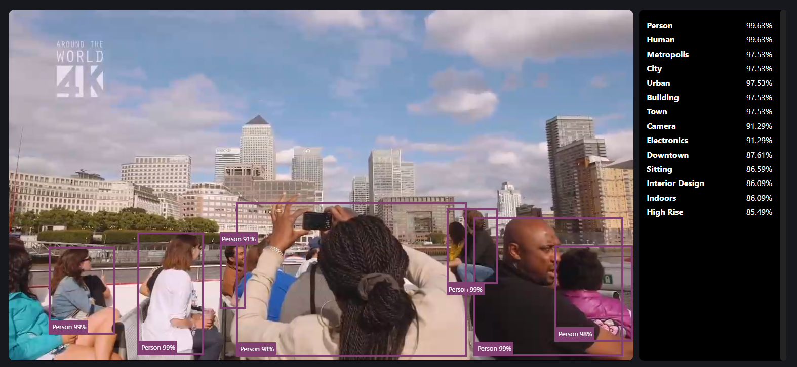
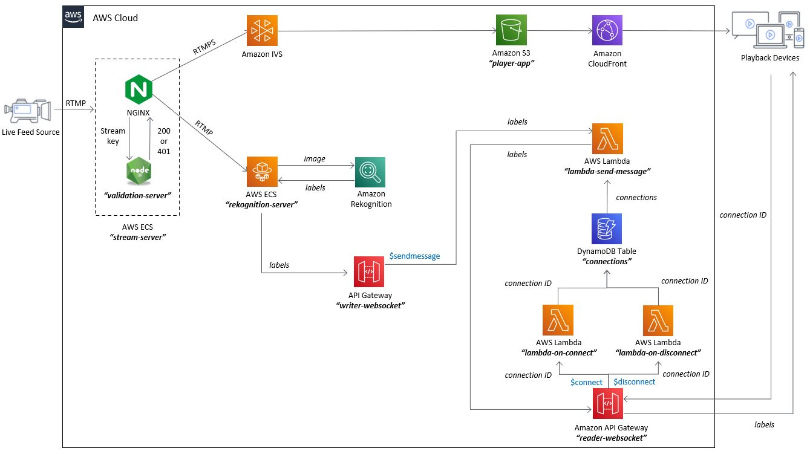

# Amazon IVS Rekognition Web demo

A demo web application for demonstrating how you can use Amazon IVS in conjunction with Amazon Rekognition to identify objects in a live stream.

**This project is intended for education purposes only and not for production usage.**

This is a serverless web application, leveraging [Amazon IVS](https://aws.amazon.com/ivs/), [Amazon Rekognition](https://aws.amazon.com/rekognition/), [Amazon ECS](https://aws.amazon.com/ecs/), [Amazon API Gateway](https://aws.amazon.com/api-gateway/), [AWS Lambda](https://aws.amazon.com/lambda/), [Amazon DynamoDB](https://aws.amazon.com/dynamodb), [Amazon S3](https://aws.amazon.com/s3/) and [Amazon CloudFront](https://aws.amazon.com/cloudfront/). The web user interface is a single page application built using [React](https://reactjs.org/) and the [Amazon IVS Player](https://docs.aws.amazon.com/ivs/latest/userguide/player.html). The demo showcases how you can add real-time object recognition to an Amazon IVS stream using Amazon Rekognition. This demo uses [Amazon API Gateway WebSockets](https://docs.aws.amazon.com/apigateway/latest/developerguide/apigateway-websocket-api.html) to deliver identified objects data to connected clients.

 

## Getting Started

⚠️ **IMPORTANT NOTE:** *Deploying this demo application in your AWS account will create and consume AWS resources, which will cost money.*

To get the demo running in your own AWS account, follow these instructions.

1. If you do not have an AWS account, please see [How do I create and activate a new Amazon Web Services account?](https://aws.amazon.com/premiumsupport/knowledge-center/create-and-activate-aws-account/)
2. Log into the [AWS console](https://console.aws.amazon.com/) if you are not already. Note: If you are logged in as an IAM user, ensure your account has permissions to create and manage the necessary resources and components for this application.
3. Follow the instructions for deploying to AWS.

### Deploying to AWS

* This demo is comprised of two parts: `serverless` (the demo backend) and `web-ui` (the demo frontend).
* To use this demo, follow the [deployment instructions](./deployment/README.md).
* To configure the demo (optional), follow the [configuration instructions](./configuration/README.md).

 

## Architecture

 

## Known issues and limitations

* The application was written for demonstration purposes and not for production use. 
* Currently only tested in **us-west-2 (Oregon)** and **us-east-1 (N. Virginia)** regions. Additional regions may be supported depending on service availability.
* Current solution has a maximum limit of 100 users connected at the same time to a given stream. Starting from 100 connected users and up, the execution time of the query to retrieve the connections to deliver the bounding boxes data is increased in a significant way, adding latency to bounding boxes data delivery and causing them to miss their corresponding display time gap until no bounding boxes are displayed at all.

 

## Estimated costs

The solution involves paid services that are charged based on your demand scenarios. Additionally, many services have a free tier with limits that can reduce the cost of running the solution. The prices may vary depending on the selected region.

> Note: These prices were estimated using multiple streaming session averages and pricing pages of each service, so they may vary depending on multiple factors such as (and not limited to) number of viewers, viewers connectivity behavior and number of recognized objects in the video. Also, note that the estimated prices are in dollars and do not include taxes.

### Rekognition pricing

This estimation is based on the prices from [Amazon Rekognition pricing](https://aws.amazon.com/rekognition/pricing/).

The current implementation takes a screenshot of the stream every 200ms, so given an hour long stream:

| Duration | Screenshot interval | Price per image* | Total images | Total price |
| -------- | ------------------: | ---------------: | -----------: | ----------: |
|   1 hour |              200 ms | $0.001 per image |        18000 |      $18.00 |

> Note: The price per image corresponds to the first price tier, which is for the first million images processed in a single month. Over a million in the same month, prices are lower.

This total price per hour is approximate, as there could be very small variations (like $0.10 or $0.20) because of the simultaneous processing of a big amount of images in a short period of time.

### Overall pricing

| Service                                                              | 1 viewer | 10 viewers | 100 viewers |
| -------------------------------------------------------------------- | -------: | ---------: | ----------: |
| [Rekognition](https://aws.amazon.com/rekognition/pricing/)           |   $18.00 |     $18.00 |      $18.00 |
| [Elastic Container Service](https://aws.amazon.com/fargate/pricing/) |    $0.49 |      $0.49 |       $0.49 |
| [Interactive Video Service](https://aws.amazon.com/ivs/pricing/)     |    $2.15 |      $3.50 |      $17.00 |
| [CloudWatch](https://aws.amazon.com/cloudwatch/pricing/)             |    $0.12 |      $0.12 |       $0.12 |
| [DynamoDB](https://aws.amazon.com/dynamodb/pricing/on-demand/)       |    $0.02 |      $0.25 |       $2.50 |
| [API Gateway](https://aws.amazon.com/api-gateway/pricing/)           |    $0.02 |      $0.25 |       $2.50 |
| [Elastic Container Registry](https://aws.amazon.com/ecr/pricing/)    |    $0.08 |      $0.08 |       $0.08 |
| [Lambda](https://aws.amazon.com/lambda/pricing/)                     |    $0.25 |      $0.25 |       $0.25 |
| [S3](https://aws.amazon.com/s3/pricing/)                             |    $0.00 |      $0.00 |       $0.00 |
| [CloudFront](https://aws.amazon.com/cloudfront/pricing/)             |    $0.02 |      $0.02 |       $0.02 |
| Total cost                                                           |   $21.15 |     $22.96 |      $40.96 |

 

## About Amazon IVS

Amazon Interactive Video Service (Amazon IVS) is a managed live streaming solution that is quick and easy to set up, and ideal for creating interactive video experiences. [Learn more](https://aws.amazon.com/ivs/).

* [Amazon IVS docs](https://docs.aws.amazon.com/ivs/)
* [User Guide](https://docs.aws.amazon.com/ivs/latest/userguide/)
* [API Reference](https://docs.aws.amazon.com/ivs/latest/APIReference/)
* [Learn more about Amazon IVS on IVS.rocks](https://ivs.rocks/)
* [View more demos like this](https://ivs.rocks/examples)